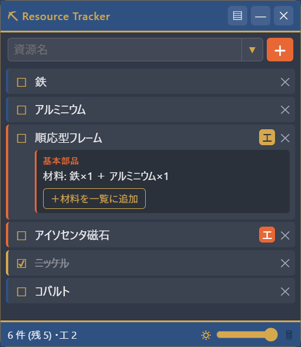

# StarfieldResourceTracker

Starfield のクラフトで集めたい資源を一覧管理する、**常時最前面のオーバーレイアプリ**です。
ゲームをボーダーレスウィンドウモードで起動すれば、その上に半透明の小窓を重ねて表示できます。

<p align="center">
  
</p>

## 特徴

- 🪟 **オーバーレイ表示** — 枠なし・半透明・常時最前面。ドラッグで移動、不透明度も調整可能
- 📝 **資源の追跡** — 集めたい資源を追加し、収集済みをワンクリックでトグル（打ち消し線）
- 🔎 **日本語の候補ドロップダウン** — マウスホイールでスクロール、入力で絞り込み
- 🛠 **工業作業台バッジ** — 工業作業台で作れる資源に「工」バッジを表示。クリックでレシピ（解放条件・材料）を展開し、材料をまとめて一覧に追加できる
- 💾 **自動保存** — 内容は自動保存され、再起動で復元
- 🔔 **システムトレイ常駐** — 非表示にしてもトレイアイコンやホットキーからいつでも復帰
- 🎨 **コンステレーション配色** — Starfield のコンステレーションカラーで統一

## 使い方

1. [Releases](../../releases) から `StarfieldResourceTracker x.y.z.exe`（ポータブル版）をダウンロードして起動、
   またはインストーラ版 `... Setup x.y.z.exe` をインストール
2. Starfield を **「ボーダーレスウィンドウ」モード**で起動（排他的フルスクリーンの上には重ねられません）
3. 資源名を入力／候補から選んで追加。行クリックで収集済みトグル、`✕` で削除
4. 「工」バッジのある資源はクリックでレシピを確認、`＋材料を一覧に追加` で素材を登録

### ホットキー

| キー | 動作 |
| --- | --- |
| `Ctrl+Shift+S` | 表示 / 非表示の切り替え |

非表示中はタスクトレイのアイコン（左クリックで表示、右クリックでメニュー）からも復帰できます。

## 開発

```bash
npm install      # 依存関係をインストール
npm start        # 開発起動
npm run dist     # Windows 向け exe（portable + インストーラ）を dist/ に生成
```

- 技術構成: Electron（main / preload / renderer の3層、`contextIsolation` 有効）
- データ永続化: `userData` 配下の `tracker.json`
- 資源／レシピデータ: [`src/data/resources.js`](src/data/resources.js), [`src/data/craftables.js`](src/data/craftables.js)（自由に編集可）

## 注意事項

- オーバーレイは **ボーダーレスウィンドウ前提**です。ゲーム側の表示モードを設定してください。
- exe には署名がないため、初回起動時に SmartScreen の警告が出ることがあります（「詳細情報」→「実行」で起動可）。

## データ出典

- 資源名: [h1g.jp Starfield Wiki](https://www.h1g.jp/starfield/?%E8%B3%87%E6%BA%90)
- 工業作業台レシピ: [monogamer.net](https://monogamer.net/sf/craft-industry/)

## ライセンス

MIT
